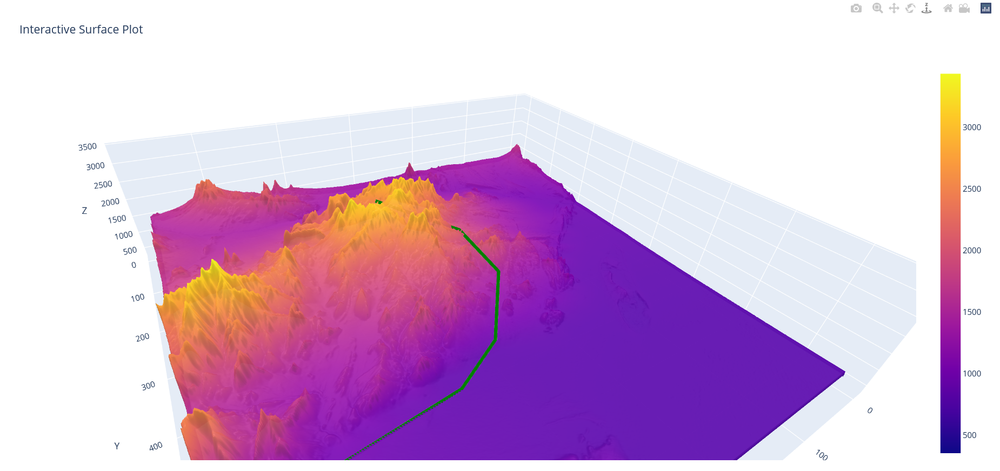
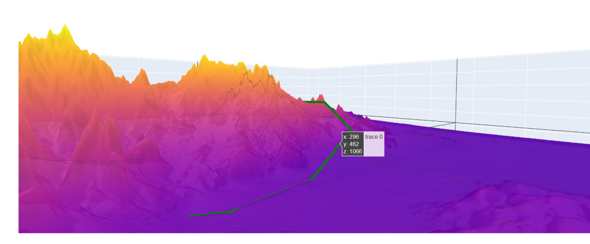
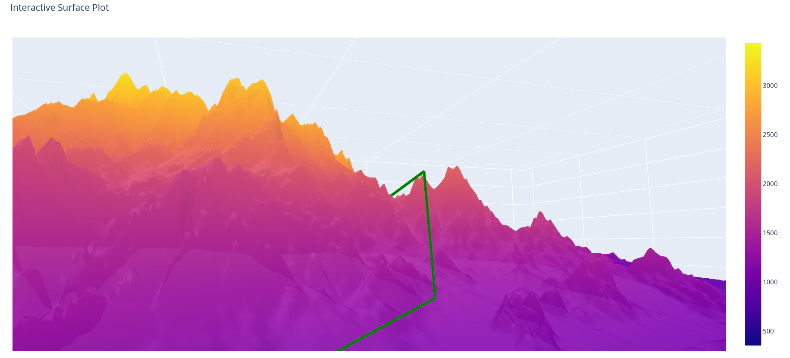

# UAV
This repository contains NSGA II UAV's path finding material. You can run one of the HTML files to use interactive 3-D map
I can not share the MAP datas because they are for the government.

